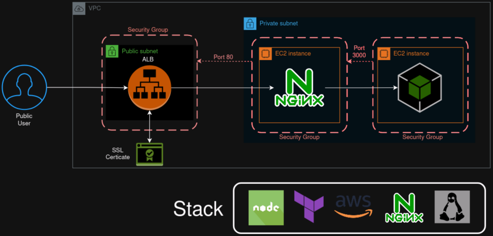

## Descrição da aplicação 

Implantação de uma API em NodeJs na nuvem(AWS). A API fornece frases aletória em formato JSON atravéz do endpoint `http:\\<host>:<port>\frases-aleatorias`. Essa API é criada em uma subnet privada e acessada através do NGinX, que atua como um ferramente de proxy reverso. O NginX também está em uma rede privada e é acessado a partir de um Application Load Balancer(ALB).

[Mais detalhes sobre o projeto](https://vinicius-samy.notion.site/Nginx-NodeJS-Docker-386d44309d6a4d29ba9418a87f88d1fb?pvs=4)


## Deploy da Aplicaçao

1. **Criar uma Access Key na conta AWS:**

   - Na sua conta AWS, crie uma access key com as permissões necessárias para realizar o deploy de VPC, Subnet, EC2, ALB, KeyPairs.
   - Recomenda-se criar uma política personalizada no IAM para limitar as permissões ao mínimo necessário, em vez de conceder permissão de administrador.

2. **Configurar o AWS CLI:**

   - Configure o AWS CLI utilizando as access keys geradas.

3. **Clonar o repositório e configurar variáveis:**

   - Clone o repositório para o seu sistema local.
   - No arquivo `iaac/variables.tf`, substitua os valores das variáveis, sendo as mais importantes:
     - `keypair_path`: Caminho para a chave SSH que será associada às instâncias do NginX e NodeJs.
     - `api_servername`: O endereço de DNS do seu domínio que irá apontar para o load balancer.
     - `certificate_arn`: ARN do certificado SSL criado no serviço Certificate Manager da AWS.

4. **Executar o Terraform:**

   - Dentro do diretório `/iaac`, execute o comando no terminal:
     ```
     terraform apply
     ```

5. **Configurar o DNS do seu domínio:**

   - No seu domínio DNS, crie um registro do tipo CNAME que aponte para o DNS do Load Balancer.
      - Deve ser coincidir com o valor da variável `keypair_path` em `iaac/variables.tf`.
   - Supondo que seu domínio criado seja: `onephrase.meu dominio`, você pode acessar sua aplicação pelo link:
     ```
     https://onephrase.meu dominio/frase-aleatoria
     ```
---
Certifique-se de revisar e configurar corretamente todas as etapas do processo, pois erros podem ocorrer em qualquer ponto. 
Mantenha a segurança em mente ao conceder permissões e configurar as chaves de acesso na AWS.
